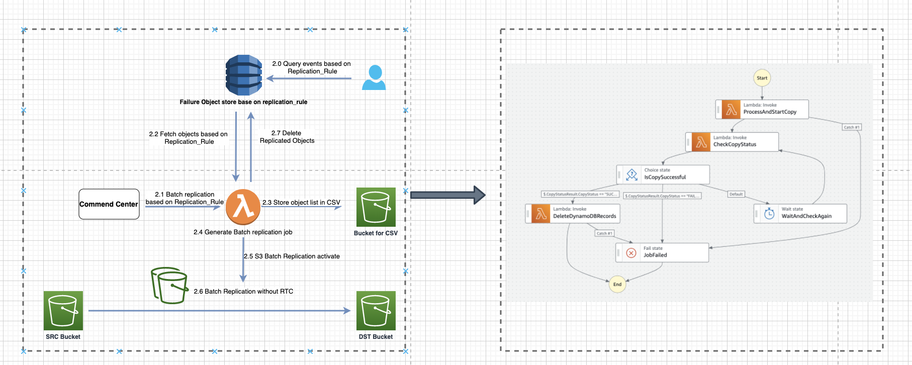

# s3_replication_failure_remediation

## General Introduction
Amazon S3 users often configure S3 replication rules for data redundancy in Disaster Recovery (DR) scenarios. However, replication may fail due to issues like permission errors or network jitters. Without explicit retry rules in S3 replication, finding a fallback synchronization solution for such failures is challenging. This article presents a timely and easily queryable contingency plan.

This site details the remediation process for handling Amazon S3 replication failure events and subsequent batch replication 

## Architecture Introduction

The architecture comprises two parts: 1. Capturing and storing failure events (Red), and 2. Querying failures based on replication rule and handling batch replication for remediation (Blue).


#### Step 1. Replication Failure Event automatically Ingestion and storage

* **1.1 Replication Failure Events Ingestion**: Source Bucket's replication failures events are ingested into an SQS queue
* **1.2 Event/Object Handling with Lambda**: Lambda function is triggered to batch poll events from the SQS queue.
* **1.3 Ingest Failure Event**: Lambda function stores failure object in a 'Failure Object Store' per `replication_rule`.
#### Step 2. Querying Failures and Batch Replication Handling

* **2.0 Query Events Based on Replication_Rule**: Users query the failure events based on the `replication_rule`.
* **2.1 Kick off Batch Replication Job Based on Replication_Rule**: The Command Center initiates a batch replication job based on the  `replication_rule`.
* **2.2 Fetch replication failure objects based on Replication_Rule and S3 Source**:   A Lambda function retrieves failure objects by the given  `replication_rule`.
* **2.3 Store Object List in CSV**: Object lists are stored in CSV in the designated Bucket.
* **2.4 Generate Batch Replication Job**: A batch replication job is generated to handle the replication of the objects.
* **2.5 S3 Batch Replication Activation**: The S3 Batch Replication is activated, executing the batch job to replicate objects to the Destination (DST) Bucket.
* **2.6 Data Replication with and without RTC**: Data is replicated without RTC
* **2.7 Delete replicated Objects**: After all data was replicated succesfully, delete related records in Dynamodb

The entire flow could work in normal condition However, through analysis, we found several potential issues in Step 2 of the aforementioned design:
* All logic is within a single Lambda, hindering task execution observation and maintenance.
* Lambda's 15-minute runtime limit might not accommodate large-scale replication tasks.

To address these, we leveraged AWS Step Functions to decouple Step 2(Remediation Part)'s logic.



In the optimized architecture, we utilized AWS Step Functions to:
* Divide the Lambda function into three distinct parts: object list generation, task status monitoring, and failure record remova(**Task complete with no failed replication objects**) 

* Leveraged Step Functions' built-in features like conditional checks, loop invocations, and error handling to streamline and manage the workflow.

## Deploy and configuration
### Prerequisites and Illustration
* Install latest [AWS CLI](https://docs.aws.amazon.com/cli/latest/userguide/getting-started-install.html)
* Have an S3 Bucket for temporary file storage. It will be used as <YourCSVBucket>
* Ensure sufficient permissions for CloudFormation deployment, Step Functions invocation, and S3 Event configuration


### Deploy the stack
Download the template codes
```
git clone https://github.com/jansony1/s3_replication_failure_remediation.git 
```
Deploy Cloudformation with customized input
```
aws cloudformation create-stack \
  --stack-name [YourStackName] \
  --template-body file://allInOne_v2.yaml \
  --parameters \
      ParameterKey=AccountId,ParameterValue=[YourAccountId] \
      ParameterKey=CSVBucket,ParameterValue=[YourCSVBucket] \
      ParameterKey=DDBTable,ParameterValue=[YourTableName] \
  --capabilities CAPABILITY_NAMED_IAM
```
In above paramters:
* YourAccountId: Where the stack will be deployed
* YourCSVBucket: S3 is used to hold the list of  objects awaiting re-replication and its replication results
* YourTableName: Dynamodb stores information about objects that failed to replicate. 

After the deployment, record the **StepFunction ARN,SQS ARN**, **Dyanmodb Name** from output in any editor. Configure S3 failure event and consumption

```
aws s3api put-bucket-notification-configuration \
    --bucket <SOURCE BUCKET> \
    --notification-configuration '{
        "QueueConfigurations": [
            {
                "QueueArn": <QUEUE ARN FROM LAST STEP>,
                "Events": ["s3:Replication:OperationFailedReplication"]
            }
        ]
    }'

```
In above command:
* SOURCE BUCKET: Any Target Bucket you want to do implmenet this remediation solution
* QueueArn: Centralized Queue for events buffering and batching 

Till then, the replication failure remediation stack was deployed successfully, one may further explore all the resources in **allInOne_v2.yaml**.

### Experiments.
Just as describe in architecture charpter, the experiments follow should be:

1. Simulate S3 replication failure with permission deny from Destination Bucket or leverage latest AWS FIS for [S3 experiments](https://docs.aws.amazon.com/fis/latest/userguide/fis-actions-reference.html#s3-actions-reference-fis).
2. After that, customer may scan/query the Dyanmodb table for failure reason based on ReplicationRule.
3. Once the failure cause was resolved, it is the time to execute below command for replication remediation based on **ReplicationRule** and **SourceBucket**. Please remember to replace <State Machine ARN>  with the **StepFunction ARN** from last step

```
aws stepfunctions start-execution \
    --state-machine-arn <State Machine ARN> \
    --name "ExecutionName" \
    --input '{"ReplicationRuleId": <TargetRule>, "SourceBucket": <TargetSourceBucket>}'
```
4. After the execution, one can either query DDB table based on ReplicationRule or using yiyang's solution

## Conclusion

This solution ensures replication failures are efficiently managed, maintaining data consistency across S3 buckets. The focus is on automation, monitoring, and the reliability of the replication process

## Next Action
1. More experiements to measure the end-to-end time consumption in relation to different counts of failure event

2. Step function may hung in execution with no errors due to failed object was already recorded in DynamoDB and the corresponding data in the original bucket was deleted before step function kick start. 

