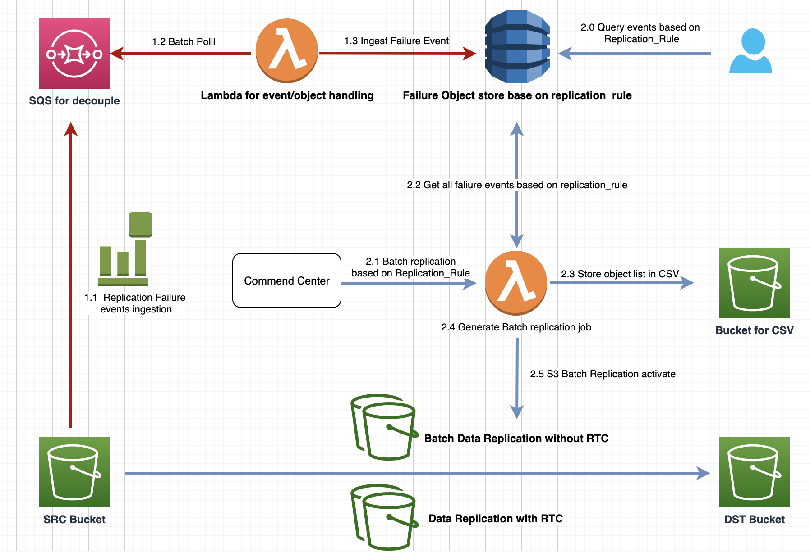
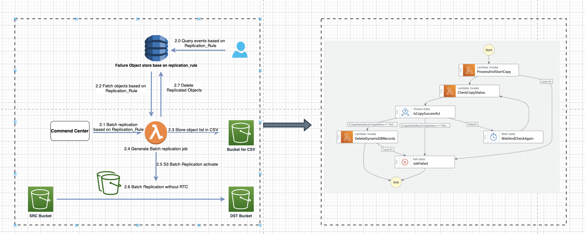

# s3_replication_failure_remediation

## General Introduction
Amazon S3 users often configure S3 replication rules for data redundancy in Disaster Recovery (DR) scenarios. However, replication may fail due to issues like permission errors or network jitters. Without explicit retry rules in S3 replication, finding a fallback synchronization solution for such failures is challenging. This article presents a timely and easily queryable contingency plan.

This site details the remediation process for handling Amazon S3 replication failure events and subsequent batch replication 

## Why this project

S3 Batch Replication can already re-replicate objects, so why build this? Because the hard part is not *running* the batch job — it is knowing **exactly which objects failed** and **why**, cheaply and in real time. This solution exists for two concrete reasons:

1. **An auditable, queryable record of every failure.** Failure events are captured in real time (S3 → SQS → DynamoDB) together with the failure reason, source/destination bucket, and replication rule. You can query "what failed, and why" per `ReplicationRuleId` at any time. A batch job is an executor; it keeps no such ledger.

2. **Avoiding a full-bucket scan on large buckets.** Without this ledger, finding the objects to re-replicate means either an S3 Inventory report (T+1 latency) or scanning the whole bucket — both slow and costly on large buckets, where you pay to inspect every object just to find the few that failed. This solution drives the batch job from a precise list whose size is `O(number of failures)`, not `O(objects in bucket)`.

In short: **this solution = a real-time failure ledger (the unique value) + the standard Batch Replication executor.** The ledger is the part S3 does not give you out of the box.

> Note on the newer S3 Batch Operations "generate object list by specifying filters" option: it filters by attributes such as creation/modification time, prefix, size, and storage class — not by *replication status* — so it does not replace the ledger. The closest native alternative is "generate based on replication configuration", but that re-introduces the full-bucket scan (and its cost/latency) and still has no failure-reason history. For small buckets or low failure rates, the native option may be simpler; for large buckets or when failure auditing matters, this solution's precise ledger remains the better fit.

## Architecture Introduction

The architecture comprises two parts: 1. Capturing and storing failure events (Red), and 2. Querying failures based on replication rule and handling batch replication for remediation (Blue).



#### Step 1. Replication Failure Event automatically Ingestion and storage

* **1.1 Replication Failure Events Ingestion**: Source Bucket's replication failures events are ingested into an SQS queue
* **1.2 Event/Object Handling with Lambda**: Lambda function is triggered to batch poll events from the SQS queue.
* **1.3 Ingest Failure Event**: Lambda function stores failure object in a 'Failure Object Store' per `replication_rule`.
#### Step 2. Querying Failures and Batch Replication Handling

* **2.0 Query Events Based on Replication_Rule**: Users query the failure events based on the `replication_rule`.
* **2.1 Kick off Batch Replication Job Based on Replication_Rule**: The Command Center initiates a batch replication job based on the  `replication_rule`.
* **2.2 Fetch replication failure objects based on Replication_Rule and S3 Source**:   A Lambda function retrieves failure objects by the given  `replication_rule`.
* **2.3 Store Object List in CSV**: Object lists are stored in CSV in the designated Bucket.
* **2.4 Generate Batch Replication Job**: A batch replication job is generated to handle the replication of the objects.
* **2.5 S3 Batch Replication Activation**: The S3 Batch Replication is activated, executing the batch job to replicate objects to the Destination (DST) Bucket.
* **2.6 Data Replication with and without RTC**: Data is replicated without RTC
* **2.7 Delete replicated Objects**: After all data was replicated succesfully, delete related records in Dynamodb

The entire flow could work in normal condition However, through analysis, we found several potential issues in Step 2 of the aforementioned design:
* All logic is within a single Lambda, hindering task execution observation and maintenance.
* Lambda's 15-minute runtime limit might not accommodate large-scale replication tasks.

To address these, we leveraged AWS Step Functions to decouple Step 2(Remediation Part)'s logic.



In the optimized architecture, we utilized AWS Step Functions to:
* Divide the Lambda function into three distinct parts: object list generation, task status monitoring, and failure record remova(**Task complete with no failed replication objects**) 

* Leveraged Step Functions' built-in features like conditional checks, loop invocations, and error handling to streamline and manage the workflow.

## Deploy and configuration
### Prerequisites and Illustration
* Install latest [AWS CLI](https://docs.aws.amazon.com/cli/latest/userguide/getting-started-install.html)
* Have an S3 Bucket for temporary file storage. It will be used as <YourCSVBucket>
* Ensure sufficient permissions for CloudFormation deployment, Step Functions invocation, and S3 Event configuration
* **The source bucket's replication rule MUST have `Replication metrics` enabled.** This is a hard requirement, not optional. The `s3:Replication:OperationFailedReplication` event — the trigger for this entire solution's ingestion path — is only emitted by S3 when the rule has Replication metrics turned on. Without it, a failed object's `ReplicationStatus` still becomes `FAILED`, but **no event is ever sent**, so the SQS queue and DynamoDB table stay empty and the solution does nothing. (RTC / S3 Replication Time Control also works, because enabling RTC forces metrics on — but RTC itself is *not* required; plain metrics is enough. Note: a `Metrics` block may only contain an `EventThreshold` when RTC is also enabled.)


### Deploy the stack
Download the template codes
```
git clone https://github.com/jansony1/s3_replication_failure_remediation.git 
```
Deploy Cloudformation with customized input
```
aws cloudformation create-stack \
  --stack-name [YourStackName] \
  --template-body file://allInOne_v2.yaml \
  --parameters \
      ParameterKey=AccountId,ParameterValue=[YourAccountId] \
      ParameterKey=CSVBucket,ParameterValue=[YourCSVBucket] \
      ParameterKey=DDBTable,ParameterValue=[YourTableName] \
      ParameterKey=Region,ParameterValue=[Region] \
  --capabilities CAPABILITY_NAMED_IAM
  # Optional: add  ParameterKey=SourceBucket,ParameterValue=[OneSourceBucket]
  # ONLY to auto-wire a SINGLE source bucket's notification. To monitor
  # multiple buckets, omit it and wire each bucket manually (see below).

# Wait for the stack to be created
aws cloudformation wait stack-create-complete --stack-name [YourStackName]

# Get the stack outputs
aws cloudformation describe-stacks --stack-name [YourStackName] --query "Stacks[0].Outputs"
```
In above paramters:
* YourAccountId: Where the stack will be deployed
* YourCSVBucket: S3 is used to hold the list of  objects awaiting re-replication and its replication results(Created before the stack)
* YourTableName: Dynamodb stores information about objects that failed to replicate. (Generated by the stack)
* SourceBucket (optional, **single bucket only**): a convenience switch for auto-wiring **one** source bucket's failure notification. This parameter does NOT define "which buckets are monitored" — a single stack can monitor **any number** of source buckets regardless of this parameter. What determines monitoring is each bucket's own notification config pointing at the stack's SQS queue (see "Event notification configuration" below). Pass `SourceBucket` only when you want the stack to auto-configure that one bucket for you; to monitor multiple buckets, leave it empty and wire each bucket manually.

After the deployment, record the **StepFunction ARN,SQS ARN**, **Dyanmodb Name** from output in any editor.

#### Event notification configuration

**If you passed `SourceBucket`**: nothing more to do — the stack's custom resource has already configured the `s3:Replication:OperationFailedReplication` notification on that bucket, and removes it again when the stack is deleted.

**If you did NOT pass `SourceBucket`** (e.g. you want one stack to serve many source buckets): configure each source bucket manually:

```
aws s3api put-bucket-notification-configuration \
    --bucket <SOURCE BUCKET> \
    --notification-configuration '{
        "QueueConfigurations": [
            {
                "QueueArn": <QUEUE ARN FROM LAST STEP>,
                "Events": ["s3:Replication:OperationFailedReplication"]
            }
        ]
    }'

```
In above command:
* SOURCE BUCKET: Any Target Bucket you want to do implmenet this remediation solution
* QueueArn: Centralized Queue for events buffering and batching 

Till then, the replication failure remediation stack was deployed successfully, one may further explore all the resources in **allInOne_v2.yaml**.

### Capacity

`ProcessAndStartCopyFunction` loads all failure records for a `ReplicationRuleId` into memory before writing the CSV manifest, so its `MemorySize` bounds how many failed objects one remediation run can handle. Measured peak footprint is **~0.95 KB per failed object** (the `all_items` list plus the dedup sets plus the two in-memory CSV buffers). Reserving ~40% of the function's memory for the Python runtime and boto3:

| MemorySize | Approx. max failed objects per run |
|---|---|
| 1024 MB | ~630,000 |
| **2048 MB (default in this template)** | **~1,260,000** |
| 3008 MB | ~1,850,000 |
| 10240 MB | ~6,300,000 |

If you expect more failures than the configured size supports, raise `MemorySize` on `ProcessAndStartCopyFunction` accordingly.

### Experiments.
Just as describe in architecture charpter, the experiments follow should be:

1. Simulate S3 replication failure with permission deny from Destination Bucket or leverage latest AWS FIS for [S3 experiments](https://docs.aws.amazon.com/fis/latest/userguide/fis-actions-reference.html#s3-actions-reference-fis).
2. After that, customer may scan/query the Dyanmodb table for failure reason based on ReplicationRule.
3. Once the failure cause was resolved, it is the time to execute below command for replication remediation based on **ReplicationRule** and **SourceBucket**. Please remember to replace <State Machine ARN>  with the **StepFunction ARN** from last step

```
aws stepfunctions start-execution \
    --state-machine-arn <State Machine ARN> \
    --name "ExecutionName" \
    --input '{"ReplicationRuleId": <TargetRule>, "SourceBucket": <TargetSourceBucket>}'
```
4. After the execution, one can either query DDB table based on ReplicationRule or using yiyang's solution

## Conclusion

This solution ensures replication failures are efficiently managed, maintaining data consistency across S3 buckets. The focus is on automation, monitoring, and the reliability of the replication process

## Current limitations

Known constraints to be aware of before adopting this solution:

1. **Single region per stack.** S3 → SQS notifications cannot cross regions, and an S3 Batch Operations job must run in the same region as its source objects. A bidirectional (DR) setup therefore needs **one stack deployed per region** — the same template, deployed with a different `--region`. One stack cannot cover both directions.

2. **Single account.** All resources (SQS, DynamoDB, Lambdas, Step Functions, batch job role) live in one account, driven by a single `AccountId` parameter. Cross-account replication remediation is not handled.

3. **Upgrading an existing stack rebuilds the DynamoDB table (data loss).** This version uses a composite partition key `BucketRuleKey` (`SRCBucket|ReplicationRuleId`) so multiple source buckets that share a replication-rule ID no longer collide. **A DynamoDB key schema cannot be changed in place.** Updating an already-deployed stack from an older (single-`ReplicationRuleId`-key) version to this one forces a table replacement — and because the table name is fixed (`!Ref DDBTable`), the `update-stack` will likely fail, and any existing failure records would be lost. This is safe for **fresh deployments**. To upgrade an existing deployment, either upgrade while the failure table is empty, or deploy with a new `DDBTable` name (and re-point/retire the old one). There is no in-place migration path.

4. **No central registry of monitored buckets.** "Which buckets feed this queue" is configured on each source bucket's notification, not in the stack. There is no built-in list of what is currently monitored — you must enumerate buckets to find out. Adding/removing a monitored bucket is done via `put-bucket-notification-configuration`, independent of the stack.

5. **Manual trigger by design.** Remediation is not automatic. The ingestion side records failures automatically, but you must start the Step Functions execution yourself (specifying the `ReplicationRuleId`). This is intentional — you should fix the root cause first, otherwise a re-run just fails again — but it means there is no auto-remediation on a threshold.

## Next Action
1. More experiements to measure the end-to-end time consumption in relation to different counts of failure event

