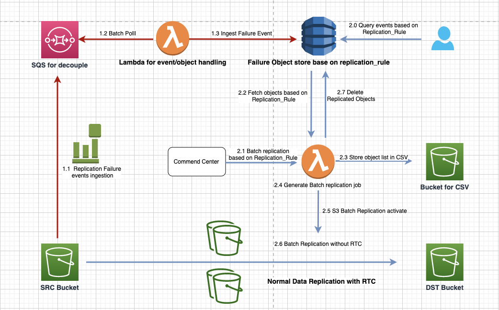

# s3_replication_failure_remediation

## General Introduction
We know that many customers configure S3 replication rules when using Amazon S3 to achieve data redundancy for DR (Disaster Recovery) purposes. In practice, we understand that replication based on S3 can fail due to various issues such as permissions, network jitter, etc. Since S3 replication itself does not have explicit retry rules, how to implement a fallback synchronization solution when such events occur has become a challenge for many customers. This article proposes a relatively timely and easy-to-query contingency plan

This document outlines the process flow for handling replication failure events in Amazon S3 and the subsequent batch replication process.

## Architecture Introduction

This architecture mainly consists of two parts: 1. the capture and storage of failure events(In Red), and 2. Failure querying based on replication and handling of subsequent batch replication(In Blue).

#### 1. Replication Failure Event Ingestion and storage

* **1.1 Replication Failure Events Ingestion**: Replication failures from the Source (SRC) Bucket are ingested into an SQS queue which acts as a decoupling buffer.

* **1.2 Event/Object Handling with Lambda**: Lambda function is triggered to batch poll events from the SQS queue.
* **1.3 Ingest Failure Event**: The Lambda function ingests failure events and stores the details in a 'Failure Object store' based on the `replication_rule`.

#### 2. Failure querying based on replication and handling of subsequent batch replication

* **2.0 Query Events Based on Replication_Rule**: Users can query the failure events based on the `replication_rule`.
* **2.1 Kick off Batch Replication Job Based on Replication_Rule**: The Command Center initiates batch replication job based on the specific `replication_rule`.

* **2.2 CSV Storage and Batch Replication Job Generation**:  Lambda function retrieves all failure events for the given `replication_rule`.
* **2.3 Store Object List in CSV**: The object list is then stored in CSV format in the designated Bucket for CSV.
* **2.4 Generate Batch Replication Job**: A batch replication job is generated to handle the replication of the data.

* **2.5 S3 Batch Replication Activation**: The S3 Batch Replication is activated, executing the batch job to replicate data to the Destination (DST) Bucket.

* **2.6 Data Replication with and without RTC**: Batch Data Replication without RTC: The data is replicated in batches without real-time consistency (RTC) to the DST Bucket.

## Deploy

## Conclusion

The entire process is designed to ensure that any replication failures are captured, logged, and then reprocessed to maintain data consistency across S3 buckets. It emphasizes automation, monitoring, and reliability in the data replication process.